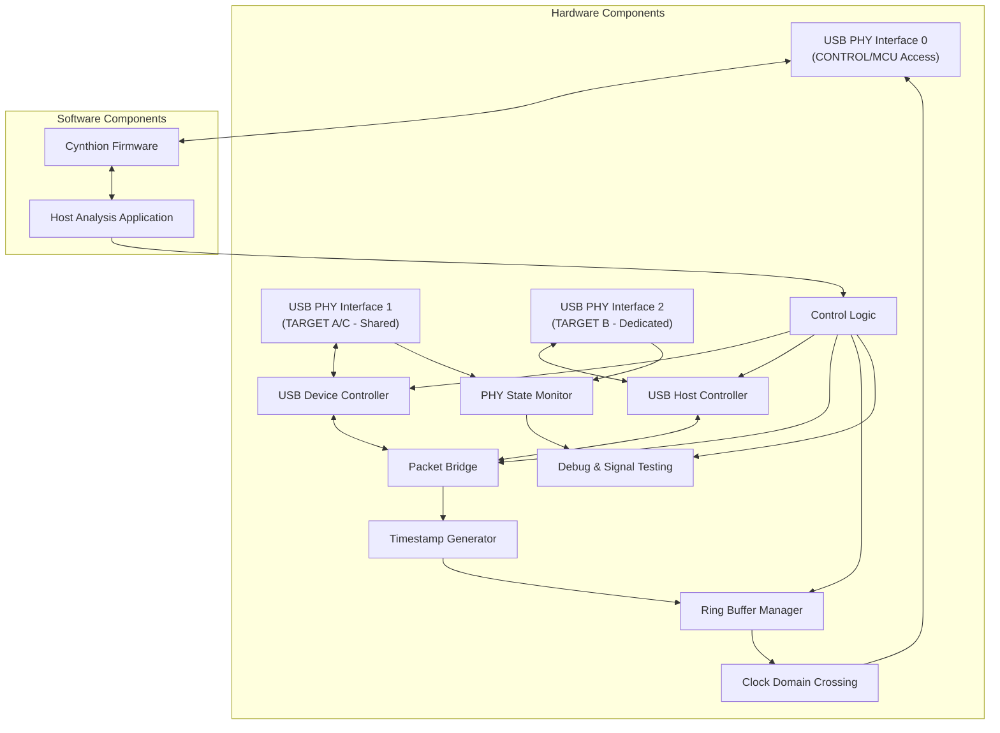
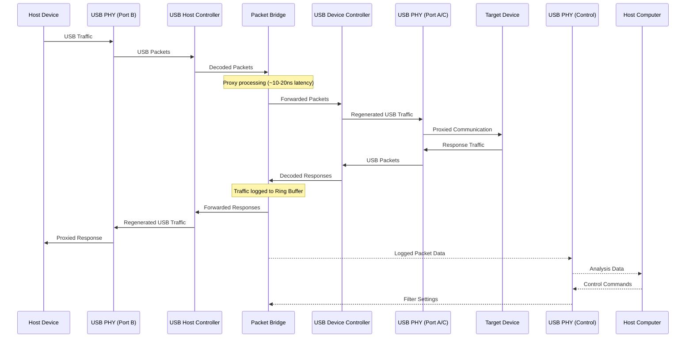

# Cynthion USB Sniffer Architecture

This document outlines the architecture for a Cynthion FPGA device project based on the Aramath framework, implementing transparent proxy-based USB sniffing capabilities between two USB interfaces.

## 1. Overall Repository Structure

```
HDL/
├── docs/
│   ├── architecture.md
│   ├── interfaces.md
│   └── user_guide.md
├── hardware/
│   ├── constraints/
│   │   └── cynthion_pins.lpf
│   ├── rtl/
│   │   ├── top.v
│   │   ├── usb_sniffer/
│   │   │   ├── usb_proxy_controller.v
│   │   │   ├── packet_bridge.v
│   │   │   ├── buffer_manager.v
│   │   │   └── timestamp_generator.v
│   │   └── usb_interface/
│   │       ├── usb_host_controller.v
│   │       ├── usb_device_controller.v
│   │       ├── usb_phy_wrapper.v
│   │       └── usb_protocol_handler.v
│   └── testbenches/
│       ├── tb_usb_proxy_controller.v
│       ├── tb_packet_bridge.v
│       └── tb_top.v
├── software/
│   ├── host/
│   │   ├── src/
│   │   │   ├── main.rs
│   │   │   ├── analyzer/
│   │   │   ├── display/
│   │   │   └── protocol/
│   │   ├── Cargo.toml
│   │   └── README.md
│   └── firmware/
│       ├── src/
│       │   ├── main.rs
│       │   ├── usb_control.rs
│       │   └── buffer_management.rs
│       ├── Cargo.toml
│       └── README.md
├── aramath/
│   └── (git submodule or reference to Aramath framework)
├── simulation/
│   ├── testcases/
│   └── waveforms/
├── build/
│   ├── bitstreams/
│   └── artifacts/
├── tools/
│   ├── generate_hdl.rs
│   └── utilities/
├── Cargo.toml
├── build.rs
└── README.md
```

## 2. Key Components and Their Interactions



## 3. Required Modules/Files (Hardware and Software)

### Hardware Modules

1. **Top Module (`top.v`)**
   - Main FPGA design entry point
   - Instantiates all major components
   - Manages clock domains
   - Handles reset synchronization

2. **USB PHY Interfaces (`usb_phy_wrapper.v`)**
   - Leverages Aramath PHY interfaces
   - Supports USB 2.0 (Low/Full/High speeds)
   - Handles differential signaling
   - Manages electrical characteristics

3. **USB Host Controller (`usb_host_controller.v`)**
   - Implements USB host stack
   - Handles device enumeration
   - Manages USB transactions with target device
   - Coordinates with packet bridge

4. **USB Device Controller (`usb_device_controller.v`)**
   - Implements USB device stack
   - Emulates target device to host
   - Handles device descriptors and endpoints
   - Coordinates with packet bridge

5. **Packet Bridge (`packet_bridge.v`)**
   - Routes packets between host and device controllers
   - Implements transparent proxy functionality
   - Handles protocol alignment and timing
   - Supports packet filtering and modification

6. **Timestamp Generator (`timestamp_generator.v`)**
   - Provides precise timing information
   - Ensures consistent timing between packets
   - Handles clock domain synchronization
   - Configurable resolution

7. **Buffer Manager (`buffer_manager.v`)**
   - Ring buffer implementation using BRAM
   - 32 KB total (16 KB per direction)
   - Tagged timestamps for packet correlation
   - Handles backpressure and flow control

8. **PHY State Monitor (`phy_state_monitor.v`)**
   - High-frequency sampling of USB line states
   - Detects J, K, SE0, SE1 states
   - Logs protocol violations and anomalies
   - Timestamps line state transitions

9. **Debug & Signal Testing (`debug_signal_test.v`)**
   - Reset pulse timing validation
   - Chirp sequence recognition
   - EOP timing validation
   - Illegal state detection

10. **Control Logic (`control_logic.v`)**
    - Manages configuration settings
    - Handles commands from host
    - Coordinates between components
    - Provides status information

### Software Components

1. **Firmware (Rust)**
   - `main.rs`: Entry point
   - `usb_control.rs`: USB interface to host
   - `buffer_management.rs`: Efficient data handling
   - `configuration.rs`: System configuration

2. **Host Analysis Application (Rust)**
   - `main.rs`: Application entry point
   - `analyzer/`: Packet analysis modules
   - `display/`: Visualization components
   - `protocol/`: USB protocol interpreters
   - `capture/`: Data capture and storage
   - `export/`: Data export utilities

3. **Build and Generation Tools**
   - `build.rs`: Build configuration
   - `generate_hdl.rs`: HDL generation from Rust
   - CI/CD configuration

## 4. Data Flow Between Components



## 5. Interface Specifications

### USB Monitoring Interface

1. **Physical Layer**
   - Three USB 2.0 compatible interfaces:
     - usb[0] = CONTROL (internal MCU access)
     - usb[1] = TARGET A/C (shared PHY)
     - usb[2] = TARGET B (dedicated)
   - Support for all USB 2.0 speeds (Low/Full/High)
   - Electrical characteristics match USB 2.0 specification
   - Transparent proxy acting as Man-in-the-Middle (MITM)

2. **Monitoring Capabilities**
   - Transparent proxy-based monitoring (active MITM between host and device)
   - Full packet capture and relay (SOF, handshaking, data packets)
   - Error detection (CRC, bit stuffing, malformed packets)
   - Timestamp resolution of 16.67ns (60MHz clock)
   - PHY line state monitoring (J, K, SE0, SE1)
   - Signal integrity testing via debug mode

### Host Communication Interface

1. **USB Interface to Host Computer**
   - USB 2.0 High Speed (480 Mbps theoretical, ~42 MB/s real-world)
   - Bulk transfers for captured data
   - Control transfers for configuration
   - Custom class device for specialized tools

2. **Control Protocol**
   - Command structure: `[CMD_ID][LENGTH][PAYLOAD]`
   - Status responses: `[STATUS][LENGTH][PAYLOAD]`
   - Register access for configuration
   - Triggering and filtering control

3. **Data Protocol**
   - Packet format: `[TIMESTAMP][FLAGS][LENGTH][DATA]`
   - Compression for efficient bandwidth usage
   - Error detection/correction
   - Flow control mechanisms

### Memory Architecture

1. **Buffer Organization**
   - Ring buffer using Block RAM
   - 32 KB total (16 KB per direction)
   - Tagged timestamps for packet correlation
   - Optimized for packet capture and flow management
   - Stays within 75% of BRAM budget

2. **Resource Usage Targets**
   - Logic elements: <40% of ECP5
   - Block RAM: <75% of available memory
   - PLLs: 2-3 for clock generation
   - DSPs: Used for timestamp calculation and signal analysis

## 6. Implementation Considerations

### FPGA Resource Optimization

1. **Memory Efficiency**
   - Optimize ring buffer for BRAM utilization
   - Implement compression for stored packets
   - Use distributed RAM for small FIFOs
   - Prioritize critical data paths

2. **Logic Optimization**
   - Leverage Aramath primitives where possible
   - Pipeline critical paths for timing closure
   - Balance between speed and resource usage
   - Consider resource sharing for similar functions

### Performance Requirements

1. **Timing**
   - Sustain full USB 2.0 High Speed (480 Mbps theoretical, ~42 MB/s real-world)
   - Minimize packet loss during bursts with efficient buffer management
   - Maintain accurate timestamps between ports
   - Handle worst-case packet storms

2. **Latency**
   - Ensure low latency operation (~10-20ns added latency in proxy path)
   - Prioritize real-time monitoring capabilities
   - Optimize host data transfer for minimal delay

3. **Line State Monitoring**
   - High-frequency sampling (60-240 MHz)
   - Track state durations for protocol analysis
   - Detect reset pulses, chirp sequences, and glitches
   - Generate timestamped reports of anomalies

### Integration with Aramath

1. **Framework Utilization**
   - Leverage Aramath's USB PHY implementations
   - Use clock domain crossing utilities
   - Integrate with packet handling modules
   - Follow Aramath's modular architecture patterns

2. **HDL Generation**
   - Use Rust-to-HDL code generator
   - Maintain compatibility with Aramath interfaces
   - Follow Aramath's module organization

## 7. Testing and Validation Strategy

1. **Simulation Testbenches**
   - Component-level tests for each module
   - System-level tests with USB protocol simulation
   - Performance testing with worst-case scenarios
   - Corner case testing for edge conditions

2. **Hardware Testing**
   - Progressive validation from basic functionality
   - Performance measurement with real USB traffic
   - Stress testing with maximum bandwidth utilization
   - Compatibility testing with various USB devices

3. **Signal Integrity Testing**
   - Reset pulse timing validation
   - Chirp sequence recognition
   - EOP timing validation
   - Illegal state detection
   - Protocol violation monitoring

4. **Continuous Integration**
   - Automated tests for hardware and software
   - Integration tests with Aramath framework updates
   - Regression testing for all features
   - Resource utilization tracking