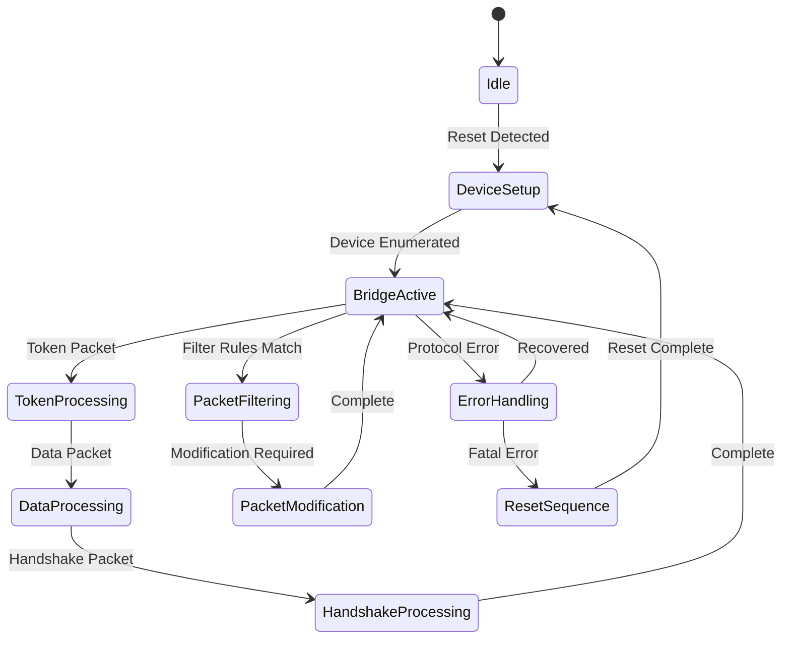
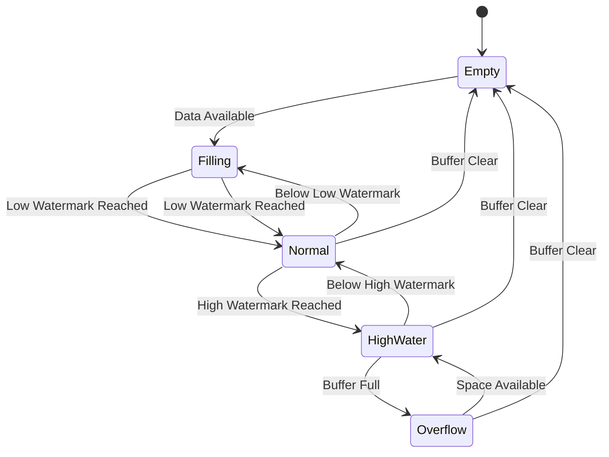

# Transparent Proxy Implementation Guide

This document provides detailed implementation guidance for the transparent proxy-based USB sniffer on the Cynthion FPGA platform.

## 1. Dual USB Controller Implementation

### USB Host Controller

```verilog
module usb_host_controller (
    input wire clk,
    input wire rst,
    
    // USB PHY Interface
    input wire [1:0] rx_data,
    input wire rx_valid,
    output reg [1:0] tx_data,
    output reg tx_valid,
    
    // Packet Bridge Interface
    output reg [7:0] decoded_data,
    output reg decoded_valid,
    output reg decoded_sop,
    output reg decoded_eop,
    input wire [7:0] response_data,
    input wire response_valid,
    input wire response_sop,
    input wire response_eop,
    
    // Control Interface
    input wire [7:0] control_reg_addr,
    input wire [7:0] control_reg_data,
    input wire control_reg_write
);
```

The Host Controller must implement:

1. **Enumeration State Machine**
   - Reset detection
   - Speed negotiation
   - Address assignment
   - Descriptor requests
   - Configuration setting

2. **Transaction Handlers**
   - IN/OUT/SETUP packet generation
   - Data toggle tracking
   - ACK/NAK/STALL response handling
   - Error recovery

3. **Timing Management**
   - SOF generation (1ms frame timing)
   - Inter-packet delays (based on USB spec)
   - Response timeouts

### USB Device Controller

```verilog
module usb_device_controller (
    input wire clk,
    input wire rst,
    
    // USB PHY Interface
    input wire [1:0] rx_data,
    input wire rx_valid,
    output reg [1:0] tx_data,
    output reg tx_valid,
    
    // Packet Bridge Interface
    output reg [7:0] decoded_data,
    output reg decoded_valid,
    output reg decoded_sop,
    output reg decoded_eop,
    input wire [7:0] request_data,
    input wire request_valid,
    input wire request_sop,
    input wire request_eop,
    
    // Control Interface
    input wire [7:0] control_reg_addr,
    input wire [7:0] control_reg_data,
    input wire control_reg_write
);
```

The Device Controller must implement:

1. **Device State Machine**
   - Default/Address/Configured states
   - Remote wakeup handling
   - Suspend/resume detection

2. **Endpoint Management**
   - Control endpoint (EP0) handling
   - Data endpoints configuration
   - Buffer management per endpoint

3. **Protocol Handling**
   - Descriptor responses
   - Status reporting
   - Error signaling

## 2. Packet Bridge Core

```verilog
module packet_bridge (
    input wire clk,
    input wire rst,
    
    // Host Controller Interface
    input wire [7:0] host_data,
    input wire host_valid,
    input wire host_sop,
    input wire host_eop,
    output reg [7:0] host_response,
    output reg host_response_valid,
    output reg host_response_sop,
    output reg host_response_eop,
    
    // Device Controller Interface
    output reg [7:0] device_data,
    output reg device_valid,
    output reg device_sop,
    output reg device_eop,
    input wire [7:0] device_response,
    input wire device_response_valid,
    input wire device_response_sop,
    input wire device_response_eop,
    
    // Buffer Manager Interface
    output reg [7:0] buffer_data,
    output reg buffer_valid,
    output reg [63:0] buffer_timestamp,
    output reg [7:0] buffer_flags,
    
    // Control Interface
    input wire [7:0] control_reg_addr,
    input wire [7:0] control_reg_data,
    input wire control_reg_write
);
```

Key Implementation Requirements:

1. **Zero-Copy Packet Forwarding**
   - Direct path from host to device and vice versa
   - Single-cycle forwarding when possible
   - Pipeline stages limited to 2-3 for minimal latency

2. **Packet Classification**
   - PID recognition (TOKEN, DATA, HANDSHAKE, SPECIAL)
   - Direction tracking (host-to-device, device-to-host)
   - Transaction correlation

3. **Packet Modification Engine**
   - Descriptor modification capability
   - Packet injection hooks
   - Selective filtering

4. **State Tracking**
   - USB device addressing
   - Transaction state
   - Endpoint states
   - Error conditions

## 3. Ring Buffer Implementation

```verilog
module ring_buffer (
    input wire clk,
    input wire rst,
    
    // Write Interface
    input wire [7:0] write_data,
    input wire write_valid,
    input wire [63:0] write_timestamp,
    input wire [7:0] write_flags,
    output wire write_ready,
    
    // Read Interface
    output reg [7:0] read_data,
    output reg read_valid,
    output reg [63:0] read_timestamp,
    output reg [7:0] read_flags,
    input wire read_next,
    
    // Status Interface
    output reg [15:0] buffer_used,
    output reg buffer_overflow,
    
    // Control Interface
    input wire buffer_clear,
    input wire [15:0] high_watermark,
    input wire [15:0] low_watermark
);
```

Implementation Strategy:

1. **Dual-Port Block RAM Utilization**
   - 32 KB total (16 KB per direction)
   - 64-bit timestamps + 8-bit flags + packet data
   - Separate read and write pointers

2. **Entry Format**
   - Header: `[64-bit timestamp][8-bit flags][16-bit length]`
   - Variable-length packet data
   - Optional padding for alignment

3. **Flow Control**
   - Watermark-based throttling
   - Overflow detection and handling
   - Prioritization based on packet type

4. **Performance Optimization**
   - Write combining for small packets
   - Burst reading for efficient host transfers
   - Optional compression for extended capacity

## 4. PHY State Monitor

```verilog
module phy_state_monitor (
    input wire clk_240mhz,  // High-frequency sampling clock
    input wire rst,
    
    // USB PHY Line State Inputs
    input wire [1:0] phy1_line_state,
    input wire [1:0] phy2_line_state,
    
    // Timestamp Interface
    input wire [63:0] current_timestamp,
    
    // Event Output Interface
    output reg event_valid,
    output reg [63:0] event_timestamp,
    output reg [7:0] event_type,
    output reg [7:0] event_data,
    
    // Control Interface
    input wire [7:0] control_reg_addr,
    input wire [7:0] control_reg_data,
    input wire control_reg_write
);
```

Key Components:

1. **High-Speed Line State Decoder**
   - 240 MHz sampling (4x USB high-speed bit rate)
   - J, K, SE0, SE1 state detection
   - Glitch filtering (configurable threshold)

2. **Protocol Violation Detector**
   - Reset duration verification (SE0 > 2.5μs)
   - Chirp sequence validation
   - EOP timing checks
   - Idle state monitoring

3. **State Transition Logger**
   - Timestamp-tagged state changes
   - Duration measurements
   - Anomaly detection
   - Event categorization

4. **Debug Interface**
   - State histograms
   - Timing statistics
   - Protocol compliance checking
   - Signal quality metrics

## 5. Implementation Timing Considerations

To achieve the target ~10-20ns latency:

1. **Clock Domain Strategy**
   - Main proxy logic at 60-120 MHz (8.3-16.7ns per cycle)
   - PHY monitoring at 240 MHz (4.17ns per cycle)
   - Limited cross-domain transitions

2. **Pipeline Optimization**
   - Critical paths limited to 2-3 stages
   - Zero-wait-state forwarding where possible
   - Priority handling for time-sensitive packets

3. **Resource Placement**
   - Host and device controllers physically adjacent
   - Packet bridge centrally located
   - Short routing paths for critical signals

4. **Clock Skew Management**
   - Balanced clock trees
   - Deterministic latency through synchronizers
   - Carefully constrained timing paths

## 6. State Machine Design

### Main Proxy State Machine



### Buffer Management State Machine



## 7. Critical Implementation Challenges

1. **Speed Negotiation**
   - Proper handling of chirp sequences
   - Transparent relay of speed capabilities
   - Synchronization of host and device controllers

2. **Clock Recovery**
   - Independent clock recovery for host and device sides
   - Elasticity buffers for rate matching
   - NRZI encoding/decoding at high speed

3. **Error Handling**
   - Corrupted packet detection and recovery
   - Protocol stall resolution
   - Timeout handling
   - Bus reset propagation

4. **Resource Utilization**
   - Efficient implementation of dual USB stacks
   - Shared resources where appropriate
   - Careful BRAM partitioning for buffer and endpoints

5. **Debug Capabilities**
   - Real-time protocol analysis
   - Comprehensive error reporting
   - Configurable verbose modes
   - Performance counters and statistics

By following this implementation guide, you can create a robust transparent proxy-based USB sniffer that provides both powerful monitoring capabilities and minimal impact on the proxied connection.